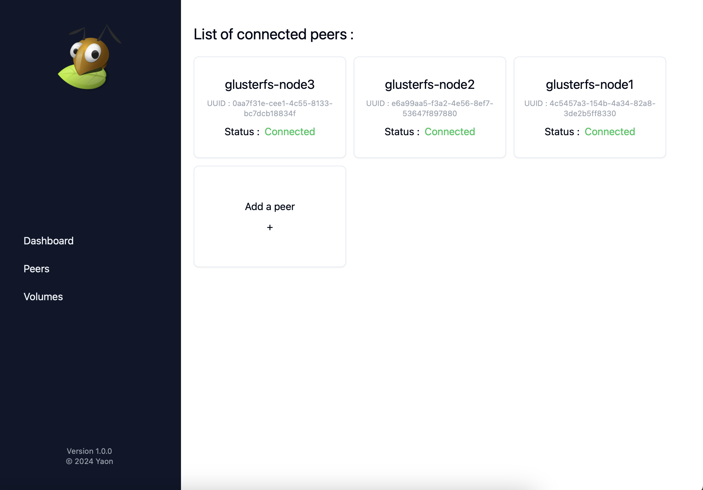
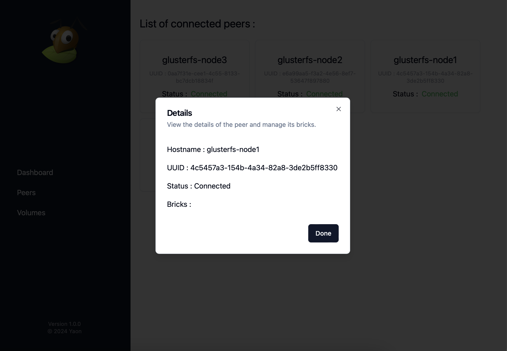
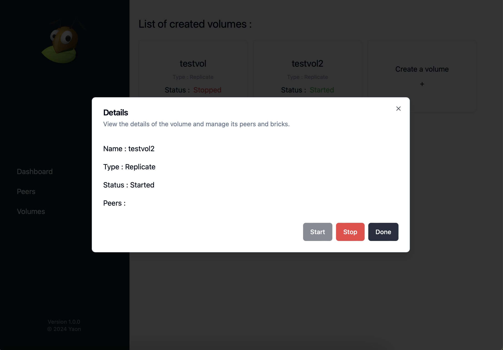
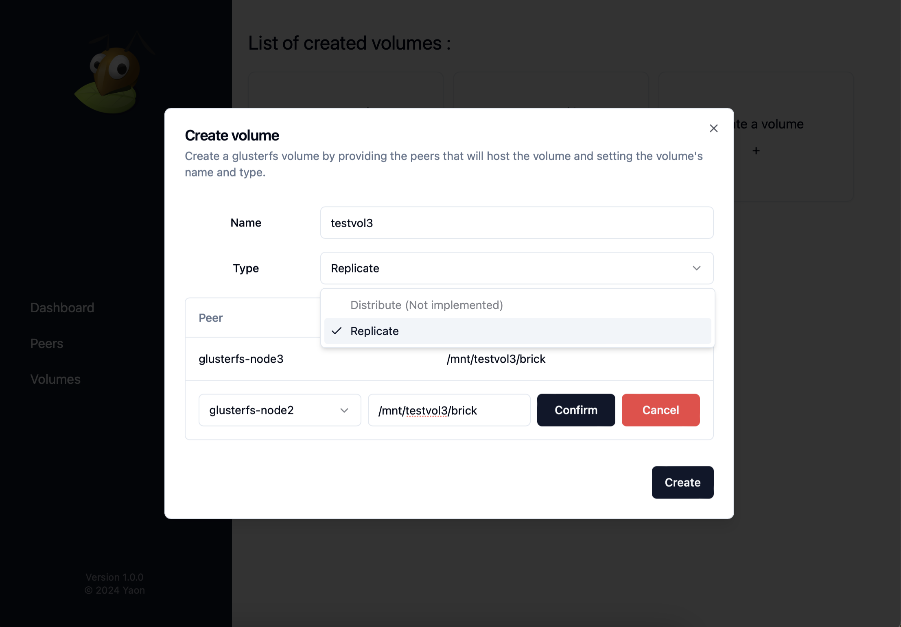

# glusterfs-webui

Go based Web UI to deploy and manage a GlusterFS cluster. Uses
the [go-glusterfs](https://github.com/Yaon-C2H8N2/go-glusterfs) library.

## Features

### List and manage peers

### List and manage volumes

